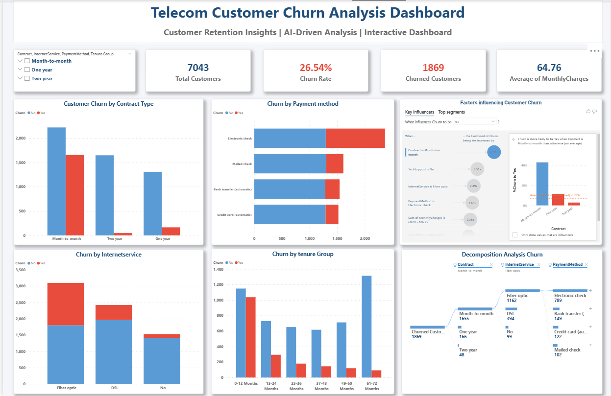
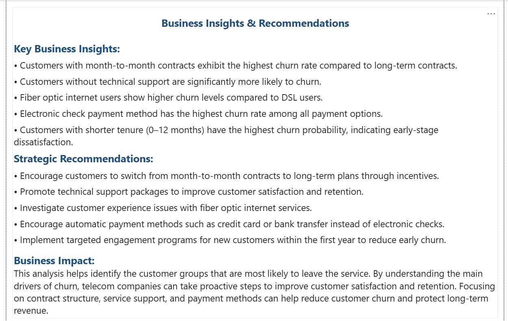

### Telecom Customer Churn Analysis Dashboard

## Project Overview
Customer churn is a major challenge for telecom companies because losing customers directly affects revenue and long-term growth.

This project analyzes telecom customer data to identify the key factors influencing customer churn and provides insights that can help companies improve customer retention.

Using Excel, SQL, and Power BI, an interactive dashboard was created to explore churn patterns, identify high-risk customers, and support data-driven decision making.

---

## Project Objectives

- Analyze telecom customer data to understand churn patterns
- Identify key factors influencing customer churn
- Build an interactive Power BI dashboard
- Generate business insights and recommendations to improve customer retention

---

## Tools & Technologies

| Tool | Purpose |
|---------------------|---------------------------------|
| Excel               | Data cleaning and preprocessing |
| SQL (MySQL)         | Data exploration and analysis |
| Power BI            | Data visualization and dashboard creation |
| Power BI AI Visuals | Key Influencers & Decomposition Tree |

---

## Dataset

Dataset used: Telco Customer Churn Dataset

The dataset contains information such as:

- Customer demographics
- Service subscriptions
- Payment methods
- Contract type
- Monthly charges
- Customer tenure
- Churn status

---

## Dashboard Features

# KPI Metrics
- Total Customers
- Churn Rate
- Churned Customers
- Average Monthly Charges

# Churn Analysis Visualizations
- Customer Churn by Contract Type
- Churn by Payment Method
- Churn by Internet Service
- Churn by Tenure Group

# AI Driven Analysis
- Key Influencers Visual to identify factors affecting churn
- Decomposition Tree to analyze churn step by step

# Interactive Filters
- Contract Type
- Internet Service
- Payment Method
- Tenure Group

---

## Key Insights

- Customers with month-to-month contracts show the highest churn rate.
- Customers without technical support are more likely to churn.
- Fiber optic internet users show higher churn compared to DSL users.
- Customers using electronic check payment method show higher churn probability.
- Customers with shorter tenure (0–12 months) have a higher churn risk.

---

## Business Recommendations

- Encourage customers to switch to long-term contracts through incentives.
- Promote technical support services to improve customer satisfaction.
- Improve service experience for fiber optic users.
- Encourage automatic payment methods instead of electronic checks.
- Implement early engagement programs to retain new customers.

---

### Business Impact

This analysis helps telecom companies identify high-risk customer segments and understand the key factors driving churn.
By applying targeted retention strategies, companies can improve customer satisfaction, reduce churn, and protect long-term revenue.

---

## 📷 Dashboard Preview

### Customer Churn Dashboard

### Business Insights Page

---
Author
Muhammed Midhilaj E
